# RADIUS LOG SERVER // 2026

A high-performance, security-focused web interface for monitoring and analyzing RADIUS/NPS logs in real-time. Built with Rust, Actix-web, and SChannel diagnostics.

```mermaid
graph TD
    subgraph "✨ UI DESIGN PREVIEW (2026 GLASSMORPHISM)"
    A["Main Dashboard"] --> B["KPI Cards (Success/Auth/Active)"]
    A["Main Dashboard"] --> C["Live Log Stream (WebSockets)"]
    A["Main Dashboard"] --> D["Stats Grid (Chart.js)"]
    A["Main Dashboard"] --> E["Diagnostic Console (SChannel)"]
    end
```




> [!NOTE]
> The interface uses a deep dark theme with translucent glass panels, cyan/green high-contrast accents, and modern typography (Inter/JetBrains Mono).

## Core Features

- **🚀 Real-time Monitoring**: Live log stream via WebSockets with integrated file watching.
- **🛡️ Security Audit**: Deep inspection of server TLS protocols, cipher suites, and local certificates (CryptoAPI/Registry).
- **🔎 SChannel Diagnostics**: One-click analysis of SChannel authentication failures directly from the log interface.
- **📊 Analytics Dashboard**: KPI cards and real-time charts (via Chart.js) for rejection rates and user activity.
- **🌐 Offline Reliability**: All assets (fonts, scripts) are embedded or localized for air-gapped environment compatibility.
- **📦 Rolling Logs**: Integrated application logging with auto-rotation (20MB limit, 5 archives).

## Technical Stack

- **Backend**: Rust (Actix-web, Tokio, Notify, Windows-RS)
- **Frontend**: Clean Modern CSS (Glassmorphism), Vanilla JS, Chart.js
- **Design**: Premium "2026" aesthetic with Inter & JetBrains Mono typography.

## Quick Start

### Prerequisites
- Rust 1.82+
- Windows OS (for SChannel/Registry diagnostics)

### Build & Run
```powershell
# Build for release
cargo build --release

# Run the server (default port 8080)
./target/release/radius-log-webserver

# Run with a custom port
$env:PORT=9000; ./target/release/radius-log-webserver
```
The server will be available at `http://localhost:8080` (or your custom port) and on your local network.

## Deployment

This project includes a **Nightly Build** CI/CD pipeline. Every commit triggers a fresh build and release available on GitHub.

---
**SYSTEM ARCHITECT: OLIVIER NOBLANC** // RADIUS SECURITY CORE v2026
